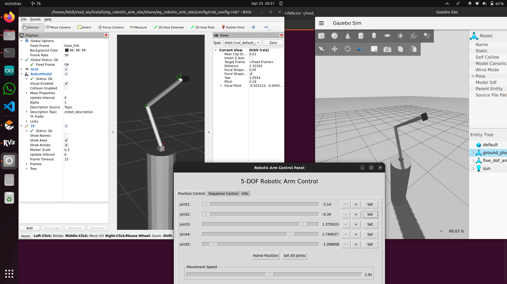

# A Dcokerized version of Robotic Arm Simulation of Team Horizon, CUSAT
This simulation uses the latest robotic arm of Horizon as per (23/04/2025). 
- #### Note : And since it uses Horizon Repositories, You may not be able to use this. Contact any of Team Horizon Member to get permission or alternative.
- #### My contact details
  - ```+91 9526393226```
  - ```binil10032005@gmail.com```

## Setup
- ### Clone the repo to your desired folder recursively
  ```shell
  git clone --recurse-submodules git@github.com:RealDev05/RoboticArmSim_Dockerized.git
  ```
  Note : If you accidentally did without recursive flag, run this
  ```shell
  git submodule update --init --recursive
  ```
- ### Build image
  ```shell
   cd RoboticArmSim_Dockerized
   sudo docker build -t arm_simulation .
  ```
## Run the docker container
```shell
cd scripts
./run.sh
```
## Open Terminal
Run the command 
```shell
./enter.sh
```
## Stop container
This is already happening when you run ```run.sh``` but if you need to stop it for some reason, then execute below
```shell
./stop.sh
```
## Execution
- To launch the simulation, run
  ```
  ros2 launch my_robotic_arm_sim sim_launch.py
  ```
- To test the controls, run
  ```
  ros2 run my_robotic_arm_sim arm_control_panel
  ```
---
## API
- You can move the robotic arm by publishing to ```/arm_angles``` topic or Alternatively run
  ```shell
  ros2 topic pub --once /arm_angles std_msgs/msg/Float64MultiArray "{data: [0.5, 0.3, -0.5, 0.3, 0.5]}"
  ```
- You can receive feedback about the position from ```/world/arm_world/model/five_dof_arm/joint_state``` topic
